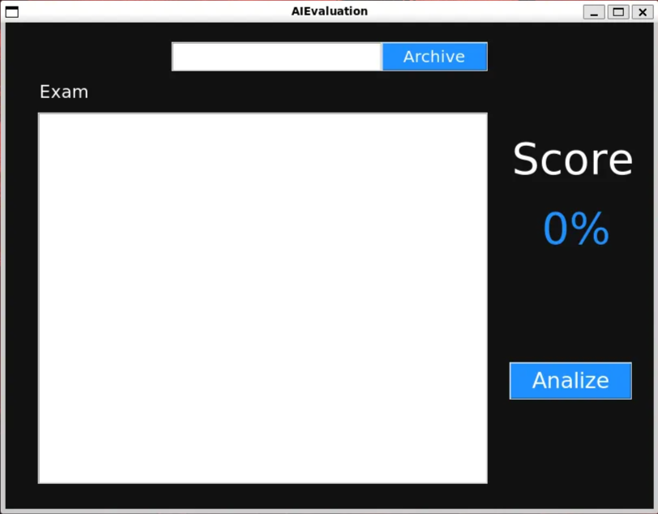
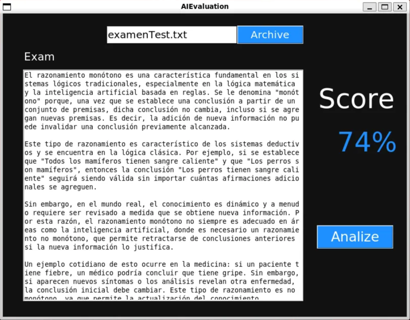

# AIEvaluation

Autor: González Silva Carlos Josué

Este programa esta siendo desarrollado para la materia de Inteligencia Artificial

---

El propósito de este programa es evaluar un examen tipo ensayo con inteligencia artificial, dando como resultado un porcentaje de asertividad en el texto, en el proyecto se utilizara la terminal de Linux (Ubuntu), el editor de texto plano vim y el lenguaje de programación Python, ya que cuenta con muchas bibliotecas para nuestro cometido, se utilizaron las bibliotecas SciKit (Para comparar textos), Tkinter (Para la interfaz grafica).

---

### Instalar SciKit y Tkinter

```python
#En la terminal escribimos lo siguiente

#Para utilizar scikit
pip install scikit-learn

#Para tener una interfaz grafica
sudo apt-get install python3-tk
```

---

### Utilizar AIEvaluation

Ejecutar programa en la terminal

```bash
python3 main.pyw
```

Desplegara esta ventana 



En la barra podemos buscar algún archivo (debe estar en la misma ubicación que el programa) y darle “Archive” para que importe el archivo.


Al darle a “Analize” nos da un porcentaje de similitud, la información a comparar se puede modificar cambiando el texto de el archivo “informacion.txt”.



También existe la posibilidad de introducir el texto a mano.